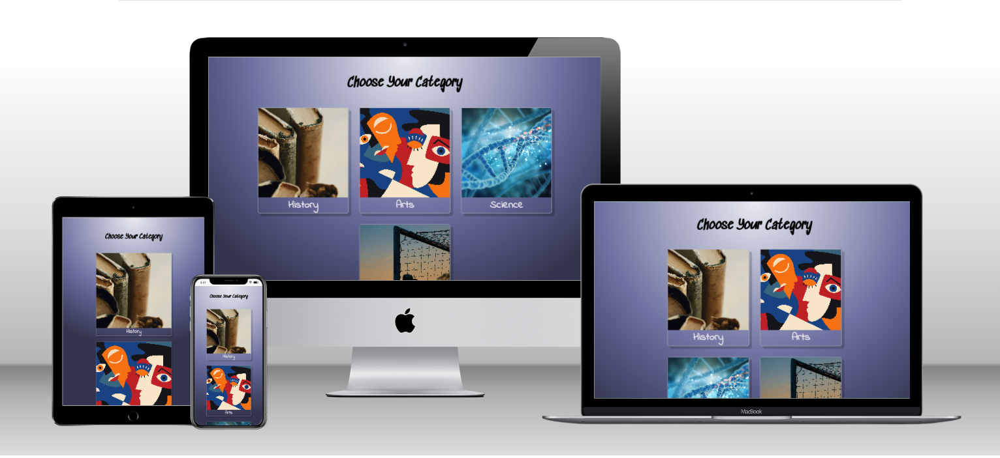
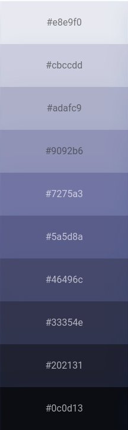

<h1 align="center">Fun Stats Website</h1>

[View the deployed project here](https://mtelewa.github.io/fun-stats)

<!--  -->

## Contents
* [User Experience (UX)](#user-experience-ux) 
* [Design](#design)
    * [Color scheme](#color-scheme)
    * [Typography](#typography)
    * [Imagery](#imagery)
    * [Wireframes](#wireframes)
    * [Accessibility](#accessibility)
* [Features](#features)
* [Technologies Used](#technologies-used)
    * [Languages](#languages)
    * [Frameworks, Libraries & Programs](#frameworks-libraries--programs)
* [Testing](#testing)
    * [Validator Testing](#validator-testing)
    * [Browser Compatibility](#browser-compatibility)
    * [Accessibility and Performance](#accessibility-and-performance)
    * [Test Cases and Results](#test-cases-and-results)
    * [Known Bugs](#known-bugs)
* [Deployment & Local Development](#deployment--local-development)
    * [Deployment](#deployment)
    * [Local Development](#local-development)
* [Credits](#credits)
    * [Code Used](#code-used)
    * [Content](#content)
    * [Media](#media)
    * [Acknowledgement](#acknowledgement)

- - -

## User Experience (UX)

### User Stories

#### First Time Visitor Goals

* I want to get informed about some interesting and shocking facts
* I want to increase my knowledge in different topics

#### Returning Visitor Goals

* I want to know more facts and check out different topics

#### Frequent Visitor Goals

* I want to improve my score and solve as many questions with the exact correct answer

- - -

## Design

### Color Scheme

The colors chosen were based on pantone colot palette like [this](https://icolorpalette.com/color/pantone-10239-c). This was inspired by the "Extraterrestrial" color palette in the book "Color Harmony" by Leatrice Eiseman. The colors are to represent a deep dive into each category, also an increasing level of difficulty as the user progresses.
 
 

    

### Typography

Google Fonts was used to import the chosen fonts. The three main fonts used across the website are

* [Segwick Ave](https://fonts.google.com/specimen/Sedgwick+Ave)
* [Platypi](https://fonts.google.com/specimen/Platypi)
* The `Indie Flower` font was inspired by [this page on Medium](https://bootcamp.uxdesign.cc/10-best-script-and-handwritten-google-fonts-afc4b77fdb0c)

These fonts were chosen to convey the playful nature of the website since it is a quiz. Also, I wanted to deliver this hand-written feeling to attract users from different ages.

### Imagery

* The icons chosen next to the topic header are to reflect the topic nature

### Wireframes

### Accessibility

The website is as accessible as possible. Specifically by following these good-practice guidelines

- - - 

### Features

The website consists of 
* 

The main features of the website are

* 

* Future Implementations that shall allow returning and frequent users to visit more often

    * 

- - -

## Technologies Used

### Languages

* HTML5
* CSS3
* JavaScript

### Frameworks, Libraries & Programs 

* [Git](https://git-scm.com/) for version control

* [Github](https://github.com/) to store code and other files

* [GitPod](https://gitpod.io/) IDE to create and edit the codes

* [Google Fonts](https://fonts.google.com/) to import the fonts used on the website.

* [Google Developer Tools](https://developers.google.com/web/tools) for troubleshooting, checking responsiveness and styling

* [Fontawesome](https://fontawesome.com/) for the icons near the header

* [Ilovemage](https://www.iloveimg.com/) to compress and resize images

* [Techsini](https://techsini.com/multi-mockup/) to show the website image on a range of devices

* [Lighthouse](https://chromewebstore.google.com/detail/lighthouse/blipmdconlkpinefehnmjammfjpmpbjk) to check the performance, quality, and correctness of the webpage

* [Web Disability Simulator](https://chrome.google.com/webstore/detail/web-disability-simulator/olioanlbgbpmdlgjnnampnnlohigkjla) to simulate other accessibility needs

* [Color Picker](https://imagecolorpicker.com/en)

- - -

## Testing

### Validator Testing

### Browser Compatibility

* Testing has been carried out on the following browsers :
    * Chrome 123.0.6312.86 (Official Build) (64-bit)
    * Chrome 123.0.6312.99
    * Firefox 124.0.1 (64-bit) 

### Accessibility and performance

### Test Cases and Results

The following test cases were performed on each page

`index.html`

| Feature | Expected Outcome | Testing Performed | Result | Pass/Fail |
| --- | --- | --- | --- | --- |

### Known Bugs

* 

- - -

## Deployment & Local Development

### Deployment

The website is deployed using GitHub Pages. To Deploy the website:

1. Go to the [fun-stats](https://github.com/mtelewa/fun-stats/) repository for this project on Github - this was the initial name of the website
2. Navigate to settings/pages
3. From the source dropdown select "Deploy from a branch" and press save
4. The site has now been deployed and the website goes live

### Local Development

#### How to Fork

To fork the repository:

1. Go to the [fun-stats](https://github.com/mtelewa/fun-stats/) repository
2. Click the "Fork" button in the top right corner.

#### How to Clone

To clone the repository:

1. Go to the [fun-stats](https://github.com/mtelewa/fun-stats/) repository
2. Click on the "Code" button, select "SSH" and copy the link
3. Open the terminal and change the current working directory to the location you want the cloned directory to be in
4. Use the command `git clone git@github.com:mtelewa/fun-stats.git` into the terminal

Note: For step no.4 to work, first generate SSH keys and add your generated key in Account Settings -> SSH Keys. More on this can be found on the [github docs](https://docs.github.com/en/authentication/connecting-to-github-with-ssh/adding-a-new-ssh-key-to-your-github-account).

- - -

## Credits

### Code Used

* Hover to zoom effect [snippet](https://www.w3schools.com/howto/howto_css_zoom_hover.asp)
* Add hyperlink to background image [snippet](https://stackoverflow.com/questions/3778611/how-do-i-add-a-hyperlink-to-a-background-image)
* Modal window [snippet](https://www.w3schools.com/howto/howto_css_modals.asp)
* Create an array with random numbers [snippet](https://stackoverflow.com/questions/5836833/create-an-array-with-random-values)
* Slider styling [snippet](https://blog.logrocket.com/creating-custom-css-range-slider-javascript-upgrades/)

### Content

* 

### Media

* [Arts image](https://www.freepik.com/free-vector/hand-drawn-picasso-style-illustration_30116612.htm#fromView=search&page=1&position=28&uuid=295e314d-5d8b-44e0-aaad-a850a83522c4)
* [Science image](https://www.freepik.com/free-photo/dna-closely_922865.htm#fromView=search&page=1&position=14&uuid=0a791cee-f404-42cf-b709-93f87efbe547)
* [Sports image](https://unsplash.com/photos/group-of-men-playing-soccer-DRtKiuN9_Mk)
* [Histoty image](https://www.freepik.com/free-photo/books-library_9282653.htm#fromView=search&page=1&position=0&uuid=80eae2e5-56c0-460d-abce-7f36864e2de8)

### Acknowledgement

I would like to thank my Code Institute mentor Jubril Akolade for his feedback and support
