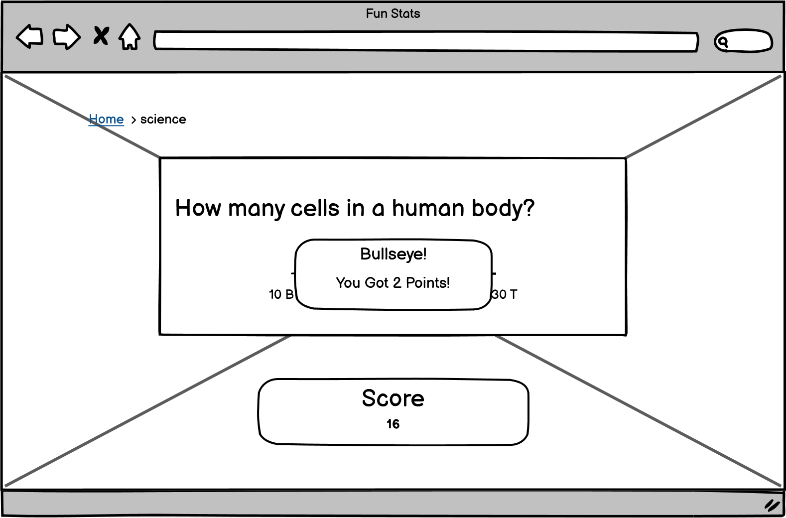
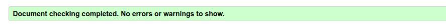
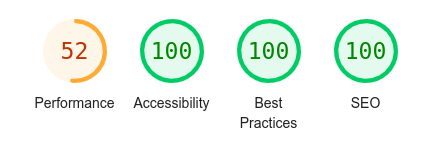

<h1 align="center">Fun Stats Website</h1>

[View the deployed project here](https://mtelewa.github.io/fun-stats)

Fun Stats is a quiz website offering 4 different categories: History, Science, Arts and Sports. The quiz is unconventional in the sense that the answers to all questions lies in the figures or statistics behind a certain event or phenomenon. The aim is to let the user grasp how huge/small or old/recent an event or a phenomenon really is.

## Contents
* [User Experience (UX)](#user-experience-ux) 
* [Design](#design)
    * [Color scheme](#color-scheme)
    * [Typography](#typography)
    * [Imagery](#imagery)
    * [Wireframes](#wireframes)
    * [Accessibility](#accessibility)
* [Features](#features)
* [Technologies Used](#technologies-used)
    * [Languages](#languages)
    * [Frameworks, Libraries & Programs](#frameworks-libraries--programs)
* [Testing](#testing)
    * [Validator Testing](#validator-testing)
    * [Browser Compatibility](#browser-compatibility)
    * [Accessibility and Performance](#accessibility-and-performance)
    * [Test Cases and Results](#test-cases-and-results)
    * [Known Bugs](#known-bugs)
* [Deployment & Local Development](#deployment--local-development)
    * [Deployment](#deployment)
    * [Local Development](#local-development)
* [Credits](#credits)
    * [Code Used](#code-used)
    * [Content](#content)
    * [Media](#media)
    * [Acknowledgement](#acknowledgement)

- - -

## User Experience (UX)

### User Stories

#### First Time Visitor Goals

* I want to get informed about some interesting facts
* I want to increase my knowledge in different topics
* I want the game rules to be easily accessible
* I want to easily navigate from category to another

#### Returning Visitor Goals

* I want to know more facts 
* I want to check out other categories
* I want to improve my score

#### Frequent Visitor Goals

* I want to get a perfect score and solve as many questions with the exact correct answer
* I want to check out other categories

- - -

## Design

### Color Scheme

The colors chosen were based on pantone color palette like as in [here](https://icolorpalette.com/color/pantone-10239-c). This was inspired by the "Extraterrestrial" color palette in the book "Color Harmony" by Leatrice Eiseman. The colors are to represent a deep dive into each category, also a calm setting to allow user to focus on the questions.
 
 

    

### Typography

Google Fonts was used to import the chosen fonts. The three main fonts used across the website are

* [Segwick Ave](https://fonts.google.com/specimen/Sedgwick+Ave) for the page header or title
* [Platypi](https://fonts.google.com/specimen/Platypi) for the answers as well as the game rules text
* The `Indie Flower` font was inspired by [this page on Medium](https://bootcamp.uxdesign.cc/10-best-script-and-handwritten-google-fonts-afc4b77fdb0c). It was used mainly for the questions.

These fonts were chosen to convey the playful nature of the website since it is a quiz. Also, I wanted to deliver this hand-written feeling to attract users from different ages.

### Imagery

* The images chosen next as a cover to each category as well as the icons in the header are to reflect the category's nature.

### Wireframes

* Wireframes were created using [balsamiq](https://balsamiq.com/). The following images serve as a preliminary design for the website interface and intended functionality.

### Accessibility

The website is as accessible as possible. Specifically by following these good-practice guidelines

* Accessible Rich Internet Applications (Aria) labels on interactive elements, links and icons
* Semantic HTML
* Using a hover state on all buttons on the website
* Sufficient color contrast throughout the website

I used the chrome extension [Web Disability Simulator](https://chrome.google.com/webstore/detail/web-disability-simulator/olioanlbgbpmdlgjnnampnnlohigkjla) to check for **total** as well as **Yellow-blue color blindness (Tritanopia)** color blindness. The latter was checked as blue is the prevailing color throughout the website. The reults are shown here, respectively.

As can be seen, there is still enough contrast between the text and the background.

- - - 

### Features

The website consists of 
* Home page with quick links to different quiz categories, contact and about pages
* Four categories pages to display quiz questions, slider and score
* Contact page to message the website hosts
* About page to explain what the website is about and what it aims at

The main features of the website are

* A **favicon** in the browser tab.

* Easily accessible icons to choose a category through text or image. Also the icons have zoom and hover effect to highlight what category the user is about to select.

*  **Toggle dialog box** to present additional information regarding game rules **without filling the page with text**.

   

* Quiz main area where the category is shown in the title, the question is displayed underneath and a slider to select the answer within a certain range and a submit button to submit the answer. The user's choice is shown as they move the slider

* A score box where the user's points are recorded and updated

* A modal winow "Game Over!" when the user inputs a wrong answer

* A modal winow "Congrats!" when the user answers all answers correctly

* About and contact pages to provide more context and depth to the website by providing form to the user to fill and information to read about the website. These pages also have buttons to navigate to the homepage

   

* Future Implementations that shall allow returning and frequent users to visit more often

    * After getting 10 correct answers, the difficulty level goes up, so now your answer has to be the exact correct answer
    * Showing users the total points they could have got if they answered all questions precisely
    * Score leaderboard to make the quiz app more competitive between users

- - -

## Technologies Used

### Languages

* HTML5
* CSS3
* JavaScript

### Frameworks, Libraries & Programs 

* [Git](https://git-scm.com/) for version control

* [Github](https://github.com/) to store code and other files

* [GitPod](https://gitpod.io/) IDE to create and edit the codes

* [Google Fonts](https://fonts.google.com/) to import the fonts used on the website.

* [Google Developer Tools](https://developers.google.com/web/tools) for troubleshooting, checking responsiveness and styling

* [Fontawesome](https://fontawesome.com/) for the icons near the header

* [Ilovemage](https://www.iloveimg.com/) to compress and resize images

* [Cloud Convert](https://cloudconvert.com/jpg-to-webp) to convert jpg to webp images

* [Techsini](https://techsini.com/multi-mockup/) to show the website image on a range of devices

* [Lighthouse](https://chromewebstore.google.com/detail/lighthouse/blipmdconlkpinefehnmjammfjpmpbjk) to check the performance, quality, and correctness of the webpage

* [Web Disability Simulator](https://chrome.google.com/webstore/detail/web-disability-simulator/olioanlbgbpmdlgjnnampnnlohigkjla) to simulate other accessibility needs

* [Color Picker](https://imagecolorpicker.com/en) for choosing colors from color palettes

* [balsamiq](https://balsamiq.com/) for wireframes

* [JSON](https://www.json.org/json-en.html) for writing the questions database

- - -

## Testing

### Validator Testing

* [HTML Validator](https://validator.w3.org/) result for the `.html` files were as following:
    
    * For the index or home page

    

    
    

    * For the quiz pages (all categories) showed the same warnings

    

    
    

    * For the contact page

    

    
    

    * For the about page

    

    
    

As seen, there are no errors and only warnings of no heading was obtained. This does not affect the functionality of the website by any means.

* [CSS Validator](https://jigsaw.w3.org/css-validator/) result for the `.css` file showed no errors, however it showed 9 warnings related to the importing of google fonts and using vendor extensions. These warnings do not affect the deployment of the website by any means

    

* [JavaScript Validator](https://jshint.com/) result for the `.js` file showed no errors, however it showed 8 warnings, all on one line where the database is imported. These warnings do not affect the logic handling, datastructure or flow control of the script.

* [JSON Validator](https://jsonlint.com/) showed that the JSON file is valid

### Browser Compatibility

* Testing has been carried out on the following browsers :
    * Chrome 123.0.6312.86 (Official Build) (64-bit)
    * Chrome 123.0.6312.99
    * Firefox 124.0.1 (64-bit) 

### Accessibility and performance

These tests were carried out using Lighthouse

`index.html`

Quiz pages

`contact.html`

`about.html`

The website scores very high on accessibility, best practices and search engine optimization. Performance can still be improved.

### Test Cases and Results

The following test cases were performed on each page

`index.html`

| Feature | Expected Outcome | Testing Performed | Result | Pass/Fail |
| --- | --- | --- | --- | --- |
| Website title | link directs the user back to the home page | click title | home page reloads | Pass |

### Known Bugs

* The website depends on *Font Awesome* package. If *Font Awesome* is down, the icons do not load and so the footer would not look as intended. The icons next to quiz page headers also will not load. This was encountered once when *Font Awesome* was having major issues.

* In small displays, the range values sometimes are squeezed by the slider when the value has large string length. A compromisation has to be done by reducing the slider length to fit the minimum and maximum values. However, this will reduce the slider area, thus affecting the user interface on mobile devices.

- - -

## Deployment & Local Development

### Deployment

The website is deployed using GitHub Pages. To Deploy the website:

1. Go to the [fun-stats](https://github.com/mtelewa/fun-stats/) repository for this project on Github - this was the initial name of the website
2. Navigate to settings/pages
3. From the source dropdown select "Deploy from a branch" and press save
4. The site has now been deployed and the website goes live

### Local Development

#### How to Fork

To fork the repository:

1. Go to the [fun-stats](https://github.com/mtelewa/fun-stats/) repository
2. Click the "Fork" button in the top right corner.

#### How to Clone

To clone the repository:

1. Go to the [fun-stats](https://github.com/mtelewa/fun-stats/) repository
2. Click on the "Code" button, select "SSH" and copy the link
3. Open the terminal and change the current working directory to the location you want the cloned directory to be in
4. Use the command `git clone git@github.com:mtelewa/fun-stats.git` into the terminal

Note: For step no.4 to work, first generate SSH keys and add your generated key in Account Settings -> SSH Keys. More on this can be found on the [github docs](https://docs.github.com/en/authentication/connecting-to-github-with-ssh/adding-a-new-ssh-key-to-your-github-account).

- - -

## Credits

### Code Used

* Hover to zoom effect [CSS snippet](https://www.w3schools.com/howto/howto_css_zoom_hover.asp)
* Add hyperlink to background image [HTML snippet](https://stackoverflow.com/questions/3778611/how-do-i-add-a-hyperlink-to-a-background-image)
* Modal window [CSS and JS snippets](https://www.w3schools.com/howto/howto_css_modals.asp)
* Create an array with random numbers [JS snippet](https://stackoverflow.com/questions/5836833/create-an-array-with-random-values)
* Slider styling [CSS snippet](https://blog.logrocket.com/creating-custom-css-range-slider-javascript-upgrades/)

### Content

* The questions were a collection of my own inquiries in addition to some help from OpenAI's [GPT](https://chat.openai.com/). It is important to note that GPT was used solely for the purpose of acquiring some questions and **NOT** for debugging or writing code. Additionally, all the facts and answers were checked through basic research.

### Media

* [Arts image](https://www.freepik.com/free-vector/hand-drawn-picasso-style-illustration_30116612.htm#fromView=search&page=1&position=28&uuid=295e314d-5d8b-44e0-aaad-a850a83522c4)
* [Science image](https://www.freepik.com/free-photo/dna-closely_922865.htm#fromView=search&page=1&position=14&uuid=0a791cee-f404-42cf-b709-93f87efbe547)
* [Sports image](https://unsplash.com/photos/group-of-men-playing-soccer-DRtKiuN9_Mk)
* [Histoty image](https://www.freepik.com/free-photo/books-library_9282653.htm#fromView=search&page=1&position=0&uuid=80eae2e5-56c0-460d-abce-7f36864e2de8)

### Acknowledgement

I would like to thank my Code Institute mentor Jubril Akolade for his feedback and support
